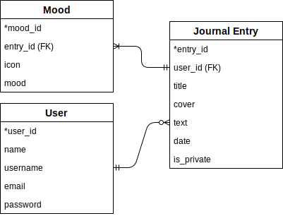

# UJournal

A journaling app.

## Technologies Used

**Database**

- [node-postgres](https://node-postgres.com/): Provides interface for connecting with PostgresQL

**Server**

- [Express](https://expressjs.com/): Minimal (key to our goal of learning fundamental patterns) and flexible Node.js web app framework.
- [body-parser](https://github.com/expressjs/body-parser): Middleware for parsing the body of a request.
- [cookie-parser](https://github.com/expressjs/cookie-parser): Middleware for parsing request cookies.
- [jsonwebtoken](https://github.com/auth0/node-jsonwebtoken): JSON Web Token implementation. Used to authorize use user

**Code Quality**

- [ESLint](https://eslint.org/): Helps identify problematic code and enforces adherence to our chosen style guidelines (see next item). Additionally, ESLint rules are well documented, serving as a learning experience that strengthens our understanding of the language.
- [AirBnB's JavaScript Style Guide](https://github.com/airbnb/javascript): Another well documented resource. Has a lot of opinions, another chance to think about the _why_ and learn new things. Yes, we like the semicolons.

**Front End**

**Deployment**

- [Heroku](https://devcenter.heroku.com/categories/nodejs-support): Free, fast and easy setup. Provides plugin for connecting a database.

## Database Information

**Entity-Relationship Diagram**


**Table Definitions**

```sql
CREATE TABLE users(
  user_id SERIAL PRIMARY KEY,
  name varchar(48),
  username varchar(48) UNIQUE NOT NULL,
  email text UNIQUE NOT NULL,
  password text NOT NULL
);

CREATE TABLE journal_entries(
  entry_id SERIAL PRIMARY KEY,
  user_id integer REFERENCES users NOT NULL,
  title varchar(48) DEFAULT now(),
  cover_url text DEFAULT '',
  entry_body text NOT NULL,
  date_created timestamp DEFAULT now(),
  is_private boolean DEFAULT true
);

CREATE TABLE moods(
  mood_id SERIAL PRIMARY KEY,
  entry_id integer REFERENCES journal_entries NOT NULL,
  icon_url text DEFAULT '',
  mood varchar(32) NOT NULL
);
```
